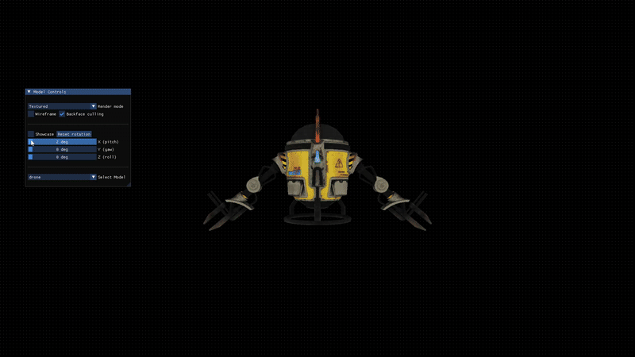

# 3d-software-renderer
A 3D graphics project I made to learn the foundations and first principles of graphics programming. The project is a 3D CPU renderer and a model viewer with as little libraries/APIs as possible.  
**Libraries:** 
- SDL2: For managing windows and rendering the framebuffer.
- stb-image: For parsing png files.
- ImGui

## Demo

## Features
- Simple linear algebra library
- Complete graphics pipeline
- Bresenham's line algorithm
- Barycentric weight based texture mapping and rasterizer
- Backface culling
- Frustum culling and clipping
- .obj parser
- Runtime model switching

## How to run with CMake
Clone the repo, create a '''/build''' directory and run ''' cmake ..'''

### Notes
My previous project was very Modern C++ focused, so for this one I tried a more C-like C++ style.  
You can check out main.cpp for an overview of the graphics pipeline and conventions used int this project.  
Many thanks to Gustavo Pezzi from [pikuma.com](https://pikuma.com) for much of the inspration and information behind the making of this project.
